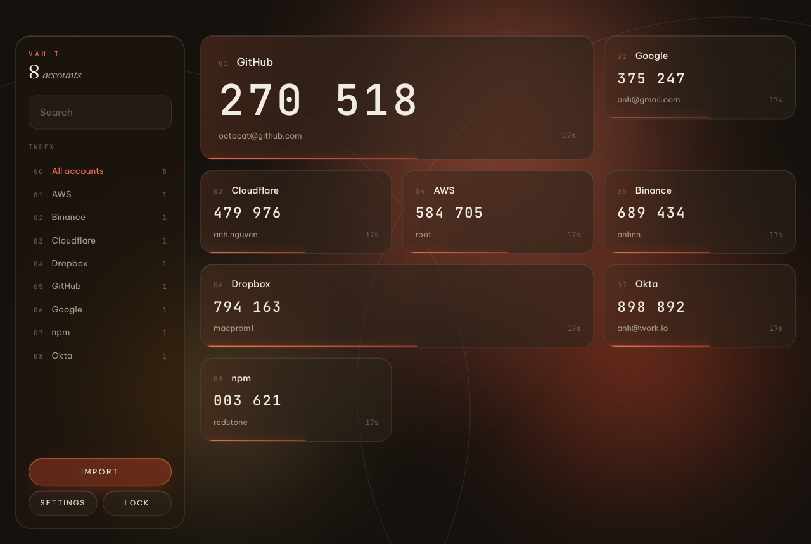

# Redstone

A desktop authenticator. Import everything out of Google Authenticator with one QR
code and get your TOTP codes on the machine you actually work on — fully offline,
encrypted at rest.



## Getting your accounts across

On your phone: **Google Authenticator → Menu → Transfer accounts → Export accounts**,
pick the accounts, and it shows you a QR code (several, if you have a lot — import
each one).

Then, in Redstone, any of:

- **Drag the screenshot onto the window.** The whole window is the drop target.
- **⌘V** a screenshot from the clipboard in the import panel.
- **Camera** — point your webcam at the phone screen.
- **Manual** — paste an `otpauth://` link or a bare base32 secret.

Duplicates are detected on import, so re-importing the same QR is harmless.

## Running it

```bash
npm install
npm run dev      # development, with hot reload
npm test         # 61 tests: RFC vectors, migration decoding, vault crypto, store
npm run build    # typecheck + production bundle
npm run dist:dmg # packaged macOS .dmg in release/
```

## How the secrets are handled

- **Encrypted at rest.** The vault is AES-256-GCM, with the key derived from your
  master password via scrypt (N=2¹⁷ — roughly a second of work per unlock, so
  offline guessing is expensive). The auth tag means a tampered file fails loudly
  instead of decrypting to garbage.
- **The master password is never stored.** Lose it and the vault is unrecoverable.
  That is the point.
- **Secrets never enter the renderer.** Codes are generated in the main process and
  pushed to the UI four times a second — the window only ever receives six digits
  and a countdown. `contextIsolation` is on, `nodeIntegration` off, navigation
  blocked, and a strict CSP allows no remote content of any kind.
- **Nothing leaves the machine.** There is no network code. Fonts are bundled.
- **Locking on quit is the security model.** Secrets live in main-process memory
  only while unlocked; there is no auto-lock on idle.
- **Backups** are written in the same encrypted format, so a backup file is as safe
  as the vault itself.

## Layout

```
src/core/      pure, testable, no Electron
  base32.ts      RFC 4648
  totp.ts        RFC 4226 / 6238
  protobuf.ts    minimal wire-format reader
  migration.ts   Google Authenticator export payload
  otpauth.ts     single-account otpauth:// URIs
  vault.ts       scrypt + AES-256-GCM
  ipc.ts         the main↔renderer contract
src/main/      window, IPC, the per-second code tick
  store.ts       the only module that touches the vault file (atomic writes)
src/preload/   the narrow contextBridge surface
src/renderer/  React + Tailwind v4, liquid-glass interface
```

## The interface

Built to the [liquid-glass-frontend](https://github.com/ngocanhnckh/liquid-glass-frontend-skill)
playbook: warm editorial direction, Fraunces / Be Vietnam Pro / JetBrains Mono, a
palette derived from three RGB triplets in `globals.css`, and real frosted glass
over a living gradient rather than transparent boxes. Light theme included.

The signature moment is the rollover: every 30 seconds the whole wall of codes
turns over at once, each row a beat behind the one above, while the clay aura
behind each tile drains away and warms to gold in the last five seconds.

Re-skin the entire app by editing three lines at the top of
`src/renderer/src/globals.css`.
